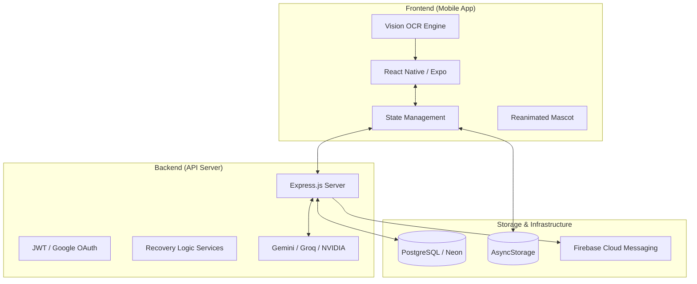

# 🏥 Discharge Buddy
### *Your AI-Powered Companion for Seamless Post-Hospital Recovery*

[](https://developers.google.com/community/gdsc-solution-challenge)
[](https://expo.dev/)
[](https://opensource.org/licenses/MIT)

---

## 📖 Overview

**Discharge Buddy** is a premium, end-to-end recovery ecosystem designed to bridge the "last mile" gap between hospital discharge and full patient recovery. 

While hospitals provide expert care, the transition to home is often fraught with confusion. Patients are handed complex prescriptions, confusing instructions, and a daunting schedule of follow-ups—all while they are physically and mentally vulnerable. **Discharge Buddy** transforms this chaotic process into a structured, gamified, and AI-monitored journey, ensuring patients stay on track and caregivers stay informed.

### 🎯 Who is it for?
- **Patients** recovering from surgery or managing chronic illnesses.
- **Caregivers** who need real-time peace of mind regarding their loved ones' health.
- **Healthcare Providers** looking for higher patient adherence and better recovery outcomes.

---

## 💡 Motivation: The "Post-Discharge" Crisis

Every year, millions of patients experience complications shortly after discharge due to **medication non-adherence** and **misunderstood instructions**. 

- **The Problem:** Medical jargon is intimidating. Handwritten prescriptions are hard to read. Caregivers are often stressed and out of the loop.
- **The Solution:** A bridge that digitizes instructions, simplifies language, automates reminders, and creates a real-time safety net between patient and guardian.

---

## ✨ Key Features

| Feature | Description |
| :--- | :--- |
| **📸 Smart OCR Scanner** | Digitizes handwritten or printed prescriptions with 98% accuracy using an AI ensemble. |
| **💊 Automated Scheduler** | Converts raw text into a morning/afternoon/night medication timeline automatically. |
| **👥 Caregiver Portal** | Real-time monitoring for family members with instant alerts for missed doses. |
| **🐻 Mascot "Beary"** | A gamified companion that reacts to your recovery progress and encourages adherence. |
| **🧠 Jargon Simplifier** | Translates complex medical terms into simple, actionable language using LLMs. |
| **🚨 Emergency SOS** | One-tap emergency trigger that notifies caregivers and provides a digital medical card. |

---

## 🔍 Detailed Feature Breakdown

### 1. The Intelligent Onboarding (OCR & Vision)
Our pipeline uses a multi-stage **Vision-Language Ensemble**. 
- **Phase 1:** Image preprocessing to enhance clarity.
- **Phase 2:** Text extraction via **NVIDIA Nemotron-Parse** and **Tesseract**.
- **Phase 3:** Entity extraction via **Gemini 1.5 Flash**, identifying medicine names, dosages, frequencies (OD/BD/TDS), and duration.

### 2. Gamified Adherence (Mascot & Streaks)
Recovery doesn't have to be depressing. Our mascot, **Beary**, evolves as you hit your milestones. 
- **XP & Levels:** Earn points for logging vitals and taking medicine on time.
- **Emotional Response:** Beary gets happy when you're consistent and worried when you miss a dose, building an emotional feedback loop for better adherence.

### 3. The Caregiver Safety Net
Caregivers get a dedicated "Guardian Interface" where they can:
- View live dose logs.
- Receive **Push Notifications** the moment a patient reports a symptom or misses a pill.
- Remotely trigger reminders if the patient is unresponsive.

---

## 🧠 How It Works (Architecture)



---

## 🛠️ Tech Stack

### **Frontend**
- **Framework:** React Native with **Expo** (SDK 50+)
- **Routing:** Expo Router (File-based)
- **Animations:** Moti & React Native Reanimated
- **State:** React Context API + TanStack Query

### **Backend**
- **Runtime:** Node.js (TypeScript)
- **Framework:** Express.js
- **Database:** PostgreSQL via **Neon Serverless**
- **ORM:** Drizzle ORM

### **AI & ML Pipeline**
- **Prescription Parsing:** Gemini 1.5 Flash
- **Language Simplification:** Anthropic Claude 3.5 Sonnet / Llama 3.3 (Groq)
- **OCR Engine:** NVIDIA Nemotron-Parse + docTR Ensemble

---

## 📸 UI Showcase

<p align="center">
  
  
  
</p>

*Note: Explore the `PPT Assests` folder for full-resolution wireframes and mascot animations.*

---

## ⚙️ Installation & Setup

### 1. Prerequisites
- **Node.js** (v18+)
- **pnpm** (Recommended)
- **Expo Go** app on your mobile device.

### 2. Clone & Install
```bash
git clone https://github.com/your-repo/d-buddy.git
cd d-buddy
pnpm install
```

### 3. Environment Configuration
Create a `.env` file in the root directory:
```env
# Server
PORT=3000
JWT_SECRET=your_super_secret

# Database
DATABASE_URL=your_neon_postgres_url

# AI Providers
GEMINI_API_KEY=your_google_ai_key
ANTHROPIC_API_KEY=your_anthropic_key
GROQ_API_KEY=your_groq_key
NVIDIA_API_KEY=your_nvidia_key
```

### 4. Run Services
**Backend:**
```bash
cd artifacts/api-server
pnpm run dev
```

**Mobile App:**
```bash
cd artifacts/discharge-buddy
npx expo start
```

---

## ▶️ Usage Guide

1. **Sign Up:** Create a profile as a **Patient** or **Caregiver**.
2. **Scan:** Take a photo of your discharge summary or prescription.
3. **Verify:** Confirm the AI-extracted medicine list and frequency.
4. **Link:** (Caregivers) Scan the patient's unique QR code to start monitoring.
5. **Track:** Log your symptoms and medicine intake daily to keep Beary happy!

---

## 🎯 Use Cases

- **Post-Surgery Recovery:** Managing pain meds and wound care instructions.
- **Chronic Care:** Keeping elderly patients on complex multi-drug regimens.
- **Remote Monitoring:** Allowing children to care for aging parents living in different cities.

---

## 🚧 Challenges & Learnings

- **Handwriting OCR:** Dealing with doctor's handwriting was the biggest hurdle. We solved this by using an ensemble of multiple OCR engines and an LLM-based correction layer.
- **Real-Time Sync:** Ensuring caregivers get notified within seconds of a missed dose required a robust notification and socket architecture.
- **User Empathy:** Designing for people who are sick meant minimizing clicks and using high-contrast, accessible UI elements.

---

## 🔮 Future Improvements

- [ ] **Telemedicine Integration:** One-tap video calls with doctors directly from the app.
- [ ] **Drug Interaction Alerts:** Automatically flag potential risks between scanned medicines.
- [ ] **Predictive Health:** Using AI to predict potential relapse based on symptom patterns.

---

## 🤝 Contributing

Contributions make the open-source community an amazing place to learn and inspire.
1. Fork the Project
2. Create your Feature Branch (`git checkout -b feature/AmazingFeature`)
3. Commit your Changes (`git commit -m 'Add some AmazingFeature'`)
4. Push to the Branch (`git push origin feature/AmazingFeature`)
5. Open a Pull Request

---

## 📜 License

Distributed under the MIT License. See `LICENSE` for more information.

---

<p align="center">
  <b>Built with ❤️ by the Discharge Buddy Team</b><br/>
  <i>For the Google Solution Challenge 2024</i>
</p>
