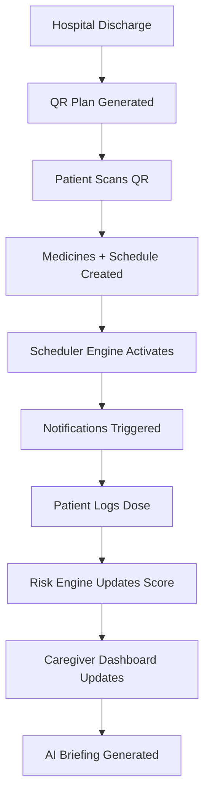

# 📘 FEATURES.md

## 🧠 Overview
**Discharge Buddy** is a high-fidelity recovery companion designed to bridge the "Care Gap" between hospital discharge and home recovery. It synchronizes medical staff (Caregivers), patients, and family members through an AI-powered ecosystem that handles prescription digitization, automated scheduling, and predictive risk monitoring.

## 🏗 Architecture
The system follows a distributed **Tri-Layer Architecture**:

1.  **Frontend (Discharge Buddy App)**: An Expo-based mobile application utilizing `react-native-reanimated` for fluid UI, `AppContext` for state management, and an `ApiProvider` abstraction for backend communication.
2.  **Core Backend (API Server)**: A Node.js Express server using **Drizzle ORM** and **PostgreSQL**. It serves as the source of truth for medication schedules, dose logs, and user roles.
3.  **Intelligence Layer (OCR Service & Gemini)**: 
    *   **OCR Ensemble**: A Python service utilizing **DocTR** and **Tesseract** to extract text from prescription images.
    *   **LLM Engine**: **Gemini 1.5 Flash** is used for clinical data normalization, instruction simplification, and generating AI Shift Briefings.

---

## 🚀 Features

### 1. Advanced Prescription Scanner (OCR Ensemble)
#### 📖 Description
Converts complex, hand-written or printed medical prescriptions into structured medication schedules automatically.

#### ⚙️ How It Works (Technical)
- **Files**: `ocr_engine.py` (Python), `ocr.ts` (API Route), `medicines.tsx` (Frontend).
- **Core Logic**: Uses a dual-engine approach (DocTR for layout, Tesseract for character refinement). The raw text is passed to Gemini via `DischargeService` to extract structured JSON (Name, Dosage, Frequency, Instructions).

#### 🔄 Data Flow
Image Capture (Frontend) → Base64 Upload → OCR Ensemble (Python) → Gemini Normalization (Backend) → Structured State (Frontend).

#### 🔗 Dependencies
- **Scheduler Engine**: Feeds directly into the medication calendar.
- **Gemini AI**: Required for clinical extraction and confidence scoring.

---

### 2. QR Recovery Handover (Import System)
#### 📖 Description
Enables a seamless clinical handover where a Caregiver generates a "Discharge Plan" QR code that the patient scans to instantly populate their entire app state.

#### ⚙️ How It Works (Technical)
- **Files**: `create-plan.tsx` (Caregiver UI), `scan-qr.tsx` (Patient UI), `DischargeService.ts`.
- **Core Logic**: The Caregiver generates a `planId`. The patient scans a QR containing this ID. The app then fetches the full plan payload and batch-inserts medications and follow-ups.

#### 🔄 Data Flow
Caregiver Input → Plan Generation (Backend) → QR Code → Scan (Patient) → Batch Data Ingestion → AppContext Update.

---

### 3. AI Predictive Risk Monitor
#### 📖 Description
A dashboard for caregivers that identifies which patients are at risk of readmission before a crisis occurs.

#### ⚙️ How It Works (Technical)
- **Files**: `caregiver.ts` (Risk Scoring Logic), `index.tsx` (Risk Gauge UI).
- **Core Logic**: Calculates a **Risk Score (0-100)** based on:
  - **Adherence**: Penalties for missed doses.
  - **Symptom Velocity**: Increasing severity of pain/fever logs.
  - **Inactivity**: Flagging "Silent Patients" who haven't logged data in >24h.

#### 🎯 UX Flow
Caregiver logs in → Views Patient List → Sees color-coded Risk Gauges (Red/Yellow/Green) → Taps high-risk patient for details.

---

### 4. AI Shift Briefing (Audio Intelligence)
#### 📖 Description
Generates a concise, spoken summary of a patient's last 48 hours for busy medical staff.

#### ⚙️ How It Works (Technical)
- **Files**: `caregiver.ts` (Gemini Summary Endpoint), `index.tsx` (Frontend Audio), `AppContext.tsx`.
- **Core Logic**: Aggregates dose logs and symptoms. Sends to Gemini with a "Busy Nurse" persona prompt. The result is played via `expo-speech`.

---

### 5. Smart Recovery Support (Breathing & Meditation)
#### 📖 Description
Interactive tools to help patients manage post-surgery anxiety and pain.

#### ⚙️ How It Works (Technical)
- **Files**: `recovery-support.tsx`, `BreathingOrb.tsx`.
- **Core Logic**: A haptic-synced "Breathing Orb" that uses `useAnimatedStyle` to guide patients through 4-7-8 breathing cycles. Triggered automatically by "Smart Suggestions" if symptoms are high.

---

## 🔗 Feature Interaction Map
The power of the system lies in its closed-loop feedback:

**Prescription Scan** ➔ **Gemini Normalizer** ➔ **Scheduler Engine** ➔ **Notification System** ➔ **Patient Log** ➔ **AI Risk Engine** ➔ **Caregiver Dashboard**

---

## ⚙️ Core Engines

### 🕒 Scheduler Engine
Located in `AppContext.tsx` and `ApiProvider.ts`. It dynamically calculates "Upcoming Doses" by comparing the current time against the `scheduledTime` array in the `medicines` table. It handles multi-day adherence tracking and streak calculation.

### 🔔 Notification System
A dual-layer system:
1.  **Device-Side (Expo Notifications)**: Scheduled locally when a medicine is added (`NotificationHelper.ts`).
2.  **Server-Side (Push Service)**: Triggered by the `caregiver.ts` inactivity engine to alert family members if a patient is "Silent."

### 🎮 Gamification Engine
Uses an XP (Experience Point) and Achievement system (`AppContext.ts`) to reward adherence. 
- **Ting! Sound**: Played via `SoundHelper.ts` on successful dose log.
- **XP Gain**: Triggers a `SuccessBurst` animation on the home screen.

---

## ⚠️ Edge Cases & Handling

| Scenario | Handling Mechanism | File Reference |
| :--- | :--- | :--- |
| **Offline Sync** | `MockProvider` fallback if API server is unreachable. | `AppContext.tsx` |
| **Missed Dose Conflict** | Doses from previous days are marked as "Missed" automatically by the Risk Engine. | `caregiver.ts` |
| **OCR Failure** | Graceful fallback to manual entry if AI confidence is < 40%. | `create-plan.tsx` |
| **Duplicate Medicine** | `DischargeService` checks for existing medicine IDs before QR import. | `DischargeService.ts` |

---

## 🔄 System Lifecycle Map
The following sequence represents the end-to-end operational flow of the Discharge Buddy platform:

## 📊 Data Flow Summary
1.  **Input Layer**: Prescription images, manual symptom logs, or Caregiver QR codes.
2.  **Processing Layer**: Python OCR extraction ➔ Gemini Clinical Normalization ➔ Backend Validation.
3.  **Storage Layer**: PostgreSQL (Drizzle) stores relational data; `AsyncStorage` caches auth tokens.
4.  **Action Layer**: Push Notifications ➔ AI Briefings ➔ Family Inactivity Alerts.
